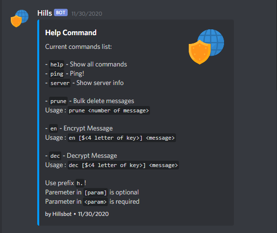
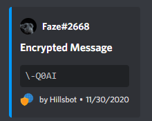
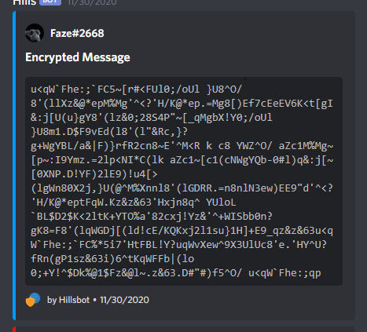
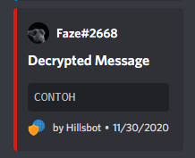
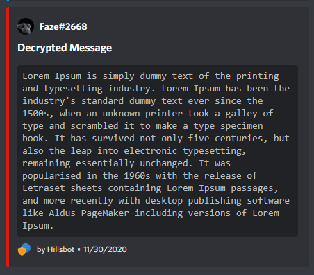

# Hillsbot
Discord bot that's made spesifically for encrypting and decrypting message using hill cipher algorithm

## Usage
 Clone this repo to your local machine 
- Locate to the directory
- Run `$ npm install` to install the required packages into your local machine
- Run `$ node .` in your terminal or you may want to run `$ nodemon .` instead for development

## Commands List

To user the bot type the prefix `h.` followed by the commands listed below:
Ex: `h.help`

### Basic Commands

### `help`
Show the list of available commands   


### `ping`
Make a ping request!  


### `server`
Show the server info

### `prune`
Bulk delete messages  
Usage : `prune <number of message>`  
Example : `h.prune 3` will delete 3 latest messages  


### Main Feature

### `en`
Encrypt message  
Usage : `en [${4 letter of key}] <message>`  

Example :   
Using the default key: `h.en CONTOH`   


Using custom key consist of 4 letter:   
`h.en $SATU Lorem Ipsum is ...`   


### `dec`
Decrypt message    
Usage : `dec [${4 letter of key}] <message>`

Example :  
Using the default key: `h.dec \-Q0AI`  


Using custom key consist of 4 letter:   
```h.dec $SATU u<qW`Fhe:;...```   



Note:  
Paremeter in `[param]` is optional  
Parameter in `<param>` is required  


## Technology Used
* Node Js
